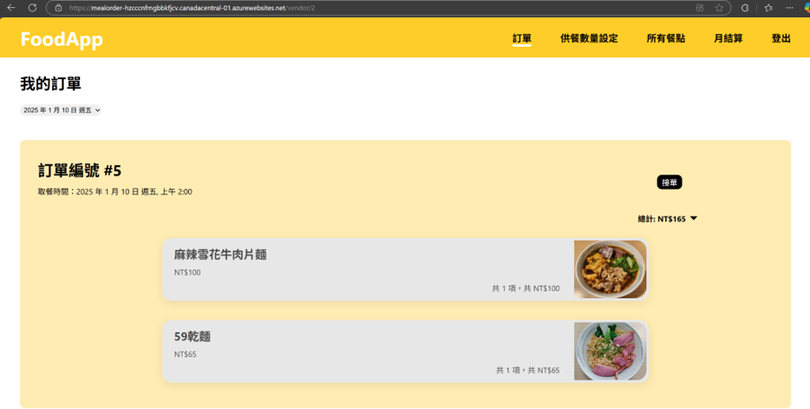

# Meal-Order
NTU CSIE 2023 Fall
<p align="center">
    
    
</p>
<p align="center">
    
    
</p>

## Env File

```
# frontend2/.env
# frontend2/.deployment.env
REACT_APP_BACKEND_URL=https://${YOUR_BACKEND_URL}
REACT_APP_WS_URL=wss://${YOUR_BACKEND_URL}
```

```
# backend/.env
# ./.env
PORT=8081
DB_HOST=${YOUR_DB_HOST}
DB_USER=${YOUR_DB_USER}
DB_PASSWORD=${YOUR_DB_PASSWORD}
DB_DATABASE=MEAL_ORDER
DB_PORT=3306
AZURE_ACCOUNT=${YOUR_AZURE_ACCOUNT}
AZURE_CONNECTIONSTRING=${YOUR_AZURE_CONNECTIONSTRING}
AZURE_CONTAINER=${YOUR_AZURE_CONTAINER}
AZURE_BLOB_SAS=${YOUR_AZURE_BLOB_SAS}
```
## Build
### Dev
docker build -t backend_dev .
docker build -t frontend_dev .
docker-compose -f docker-compose-dev.yml up

### Deployment
docker build --no-cache -t backend --secret id=env,src=./frontend2/.deployment.env -f deployment.dockerfile .
docker run --env-file=.env -p 8081:8081 -it backend